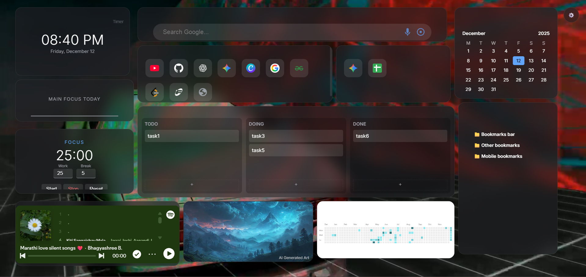

# Vyuham 🚀

*A modern glassmorphism-based Chrome new tab dashboard designed for clarity, focus, and productivity.*





***


## 📖 Table of Contents

- [Overview](#overview)
- [Features](#features)
- [Visuals](#visuals)
- [Getting Started](#getting-started)
- [Project Structure](#project-structure)
- [Tech Stack](#tech-stack)
- [Roadmap](#roadmap)
- [Contributing](#contributing)
- [Credits](#credits)
- [License](#license)

***

## 🌟 Overview

**Vyuham** replaces your default Chrome new tab with a customizable productivity dashboard featuring widgets, AI-generated backgrounds, timers, shortcuts, and more — all wrapped in a clean glassmorphism UI.

Designed for:

- Developers
- Students
- Productivity enthusiasts
- Anyone who wants a beautiful new tab experience

***

## ✨ Features

### 🔧 Core Widgets

- **Clock & Timer** – Time, date, countdown, alarm
- **Pomodoro Timer** – Customizable work/break cycles
- **Calendar** – Clean monthly view
- **Focus Task** – Your top priority always visible

### 📚 Tools & Information

- **Reading List** – Curated links with favicons
- **Bookmarks** – Chrome bookmarks + custom bookmarks
- **GitHub Contribution Chart** – For any GitHub user

### 🧩 Productivity

- **Kanban Board** – Todo → Doing → Done
- **Quick Launch Shortcuts** – User-defined with site favicons
- **Google Search** – Voice search + Google Lens shortcut

### 🎨 Visual Experience

- **AI-generated art wallpaper** (Pollinations)
- **Video backgrounds**
- **Glassmorphism UI**

### 🎵 Media

- **Music Player** – SoundCloud or Spotify embed

### 🛠 Customization

- Drag, move, and resize widgets
- Lock/unlock layout
- Export/import dashboard configuration
- Preset layouts for workflows

***

## 🎥 Visuals

*Add screenshots or GIFs here to showcase the UI.*

Example placeholders:

***

## 🚀 Getting Started

### Clone Repository

```bash
git clone https://github.com/prasadkankhar10/Vyuham
Install as Chrome Extension

Open chrome://extensions/

Enable Developer Mode

Click Load unpacked

Select the project folder

Open a new tab — Vyuham loads automatically!
```

***


## 📁 Project Structure

📦 Vyuham

│

├── manifest.json  
│   └─ Defines extension permissions, new tab override, icons, and runtime scripts.  
│

├── newtab.html  
│   └─ Main UI layout for the dashboard and all widgets.  
│

├── script.js  
│   └─ Core logic handling:  
│        • Widget initialization  
│        • Drag/resize interactions  
│        • Clock, Timer, Pomodoro logic  
│        • Kanban board system  
│        • Focus task saving  
│        • AI Art / Video background loading  
│        • Quick launch shortcuts  
│        • Bookmarks + reading list  
│        • LocalStorage-based configuration  
│

├── styles.css  
│   └─ Glassmorphism design, animations, layout grid, responsiveness.  
│

├── background.mp4  
│   └─ Optional looping video background.  
│

├── alarm.mp3  
│   └─ Alarm sound for countdowns and Pomodoro.  
│

└── assets/ (optional future folder)  
├── icons/  
├── screenshots/  
└── presets/

***


## 🧰 Tech Stack

- HTML, CSS, JavaScript
- Chrome Extensions API
- LocalStorage / Sync Storage
- Pollinations API (AI Wallpaper)
- ghchart (GitHub contribution graph)

***

## 🗺 Roadmap


- Weather Widget
- Sticky Notes Widget
- Theme Presets (Dark, Minimal, Neon)
- Multi-device sync
- Performance improvements
- Widget marketplace

***


## 🤝 Contributing

Contributions, ideas, and feature requests are welcome.  
Feel free to open an issue or submit a pull request.

***


## 🏆 Credits

- **AI Wallpapers:** Pollinations API
- **GitHub Chart:** ghchart

***


## 📄 License

MIT License.  
Free to use, modify, and customize.